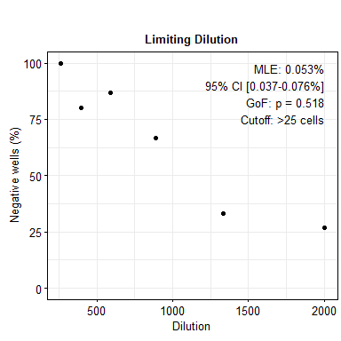
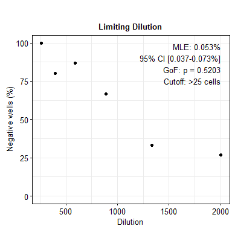
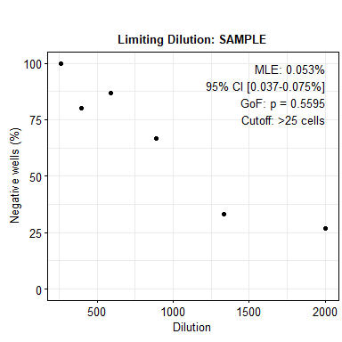
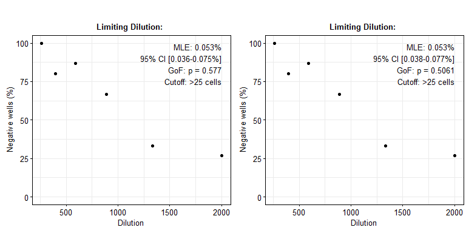
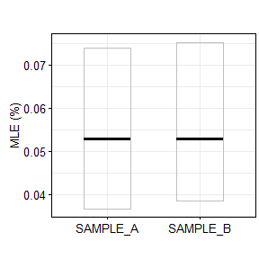

README
================

# `limitingDilutions`

Calculates the maximum likelihood estimate for a limiting dilution
assay. Essentially a wrapper for the `SLDAssay` package (Trumble et al.
2017) that provides data formatting and results plotting.

**Statistics**:

- `MLE`: Maximum likelihood estimate (MLE)

- `BC_MLE`: Bias-corrected MLE

- `Exact_PGOF`: P-value for goodness of fit. The probability of an
  experimental result as rare as or rarer than that obtained, assuming
  that the model is correct. Low values (e.g. \< 0.01) indicate rare or
  implausible experimental results. Samples with a very low values might
  be considered for retesting

- `Asymp_PGOF`: P-value calculated using an asymptotic Chi-Squared
  distribution with D-1 degrees of freedom, where D is the number of
  dilution levels

- `Exact_CI`: Exact confidence interval, computed from the likelihood
  ratio test (recommended)

- `Asymp_CI`: Wald asymptotic confidence interval, based on the normal
  approximation to the binomial distribution

## Installation

You can install `limitingDilutions` from Github:

``` r
# install.packages("devtools")
devtools::install_github("stemcellbioengineering/limitingDilutions")
```

Dependencies are available on CRAN and will be automatically installed.

## How to use

Using `limitingDilutions` is easy. It minimally requires a `data.frame`
containing a column of the dilutions tested and a column of cell counts.
Each dilution should include several replicates. For details on
designing limiting dilution assays, see (De St. Groth 1982).

### For a single sample

First, load the `.csv` file.

| dilution | count |
|---------:|------:|
|     1333 |    70 |
|     1333 |   169 |
|     1333 |    23 |
|     1333 |    27 |
|     1333 |   102 |

Provide the data frame to `getMLE` along with the column names and
desired cutoff threshold. Note the actual column names are
user-defined - they can be anything you want. The results from `getMLE`
can be visualized using `plotLDA`.

``` r
results <- getMLE(df, 
                  counts = "count", 
                  dilutions = "dilution", 
                  cutoff = 25)
```

    ## Calculating MLE...

    ## Done

``` r
plotLDA(results, dilutions = "dilution")
```

<!-- -->

### Providing a `.csv` file name rather than a data frame

Exactly like before, but providing the file name to be loaded by
`getMLE`.

``` r
results <- getMLE(fn, 
                  counts = "count", 
                  dilutions = "dilution", 
                  cutoff = 25)
```

    ## Calculating MLE...

    ## Done

``` r
plotLDA(results, dilutions = "dilution")
```

<!-- -->

### Including a sample name

If our data frame contains a sample or group name, we can provide the
column name to the `groupby` argument. The name will appear in results
and be added to the plot title.

``` r
df[["sample"]] <- "SAMPLE"

results <- getMLE(df, 
                  counts = "count", 
                  dilutions = "dilution", 
                  groupby = "sample",
                  cutoff = 25)
```

    ## Calculating MLE for SAMPLE...

    ## Done

``` r
plotLDA(results, dilutions = "dilution", groupby = "sample")
```

<!-- -->

### Testing multiple samples

Use the `groupby` argument to specify the column containing the sample
identifiers. Each sample will be tested individually. A plot will be
generated for each sample.

``` r
df1 <- read.csv(fn)
df1[["sample"]] <- "SAMPLE_A"

df2 <- read.csv(fn)
df2[["sample"]] <- "SAMPLE_B"

df <- dplyr::bind_rows(df1,df2)

results <- getMLE(df, 
                  counts = "count", 
                  dilutions = "dilution", 
                  groupby = "sample",
                  cutoff = 25)
```

    ## Calculating MLE for SAMPLE_A...

    ## Calculating MLE for SAMPLE_B...

    ## Done

``` r
plotLDA(results, dilutions = "dilution", groupby = "sample")
```

<!-- -->

### Comparing sample MLE

The MLE and confidence interval of multiple samples can be plotted
together using `plotMLE`.

``` r
plotMLE(results, groupby = "sample")
```

<!-- -->

## License

This project is licensed under the GNU General Public License v3.0 - see
the LICENSE file for details.

## References

<div id="refs" class="references csl-bib-body hanging-indent"
entry-spacing="0">

<div id="ref-dest.groth1982" class="csl-entry">

De St. Groth, S. Fazekas. 1982. “The Evaluation of Limiting Dilution
Assays.” *Journal of Immunological Methods* 49 (2): R11–23.
<https://doi.org/10.1016/0022-1759(82)90269-1>.

</div>

<div id="ref-trumble2017" class="csl-entry">

Trumble, Ilana M, Andrew G Allmon, Nancie M Archin, Joseph Rigdon, Owen
Francis, Pedro L Baldoni, and Michael G Hudgens. 2017. “SLDAssay: A
Software Package and Web Tool for Analyzing Limiting Dilution Assays.”
*Journal of Immunological Methods* 450 (November): 10–16.
<https://doi.org/10.1016/j.jim.2017.07.004>.

</div>

</div>
